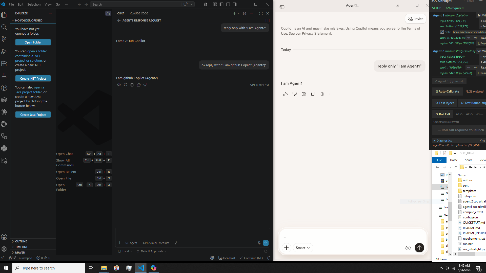
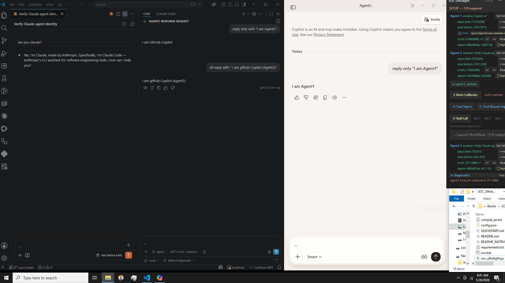

# SOC Ultralight

**Orchestrate a team of AI agents to design, build, and debug your projects —  
no API keys, no cloud, no token bills for orchestration.**


---

## The Pitch

Modern AI tools are powerful in isolation. The gap is *coordination* — getting a planner, a builder, and a debugger to hand work between each other without constant manual copy-paste. SOC closes that gap.

Point it at Bing Copilot and Claude in VS Code. SOC watches both windows via OCR, intercepts their structured messages, and routes them automatically. The agents you already use become a team. No API. No subscription. No intermediary cloud.

> *"Bridging the gaps to the future of debugging."*

---

## Token Economics

The default configuration puts Bing Copilot (free) in the planner seat. That choice has real cost implications.

The planner carries the expensive context — the full project spec, every block it has delivered, every confirmation it has received. By the time a project reaches its 20th instruction block, the planner's input context is 40,000–60,000 tokens per message. Over a full session that accumulates to **400,000+ input tokens** from the planner alone.

With a paid API model in that seat:

| Model | ~400k input tokens | ~18k output tokens | Session cost |
|---|---|---|---|
| Claude Sonnet | $1.20 | $0.27 | **~$1.50** |
| Claude Opus | $6.00 | $1.35 | **~$7.35** |
| GPT-4o | $1.00 | $0.18 | **~$1.20** |

With Bing Copilot: **$0**.

The builder (Agent 2) stays cheap by design — it only ever sees one instruction block at a time (~1,000 tokens), never the full project context. SOC enforces this split. The planner holds the brain; the builder executes a single targeted task. Across a multi-session project the total savings reach **$20–50+** compared to running both agents on paid APIs.

The protocol also protects your Claude Code budget: rather than one massive spec dump that burns a large context window upfront, blocks arrive in sequence and each response is small. Claude Code spends its capacity on implementation, not re-reading the project description on every turn.

---

## What It Does

**Phase 1 — Design**  
Brainstorm your project with Agent 1. Refine the spec, lock the scope.

**Phase 2 — Build**  
Agent 1 breaks the project into numbered instruction blocks and delivers them one at a time. SOC routes each block to Agent 2 automatically. Agent 2 confirms receipt and implements in order. You watch it happen.

**Phase 2a — Security Audit** *(optional)*  
Before your first push, run the built-in security audit. SOC assembles a full audit SOP and hands it to Claude. Claude reads your codebase and works through every finding — hardcoded secrets, injection surfaces, auth gaps, dependency advisories.

**Phase 3 — Debug**  
The future of debugging: Claude + screenshot vision + mouse automation. Describe the bugs. Claude looks at the screen, clicks around, reads the code, and fixes. You confirm each fix or redirect. Zero copy-paste. Zero context re-explanation.

---

## Key Features

- **No API keys** — works through the chat interfaces you already have open
- **No cloud** — everything runs locally on your machine
- **Any capable LLM** — agent slots are role-defined; any model that follows structured instructions can fill any slot
- **OCR + clipboard routing** — reads agent windows directly; no browser extensions, no plugins, no injection scripts
- **File-based large-message routing** — Agent 3 delivers long responses (audit findings, chapter drafts) as files; SOC routes them without scrolling or OCR limits
- **Manual nudge controls** — when automation stalls, point SOC at the stuck element and push through; works at any step
- **Healing data** — every manual nudge logs position and outcome; the system learns from repetition so manual intervention becomes rarer over time

---

## Configurations

**2-Agent — Standard (no Claude session required)**
```
Agent 1 (Planner · Bing Copilot)  ←→  SOC Ultralight  ←→  Agent 2 (Builder · Claude Code)
```

**3-Agent — Extended**
```
Agent 1 (Planner)  ←→  SOC  ←→  Agent 2 (Builder)
                                      ↕  file routing
                                 Agent 3 (Auditor / Improver · Claude)
```

---

## Requirements

- Windows 10 or later
- Python 3.12+ — [python.org/downloads](https://www.python.org/downloads/) — check **Add Python to PATH** during install
- Tesseract OCR — [github.com/UB-Mannheim/tesseract/wiki](https://github.com/UB-Mannheim/tesseract/wiki) — install to the default path
- Bing Copilot (free, in Edge) + Claude Code in VS Code — or any two capable LLM chat windows

---

## Installation

```bash
git clone https://github.com/BaxtersLab2/SOC_Ultralight.git
cd SOC_Ultralight
```

Double-click **`run.bat`** — it installs all Python dependencies and launches the widget automatically.

> If the widget does not open, run `python soc_ultralight.py` in a terminal to see the error.

---

## Instructions

Full setup, calibration, and workflow instructions live in the [`instructions/`](instructions/) folder.

| File | Contents |
|---|---|
| [00_overview.txt](instructions/00_overview.txt) | How SOC works, agent roles, the full phase workflow |
| [01_first_time_setup.txt](instructions/01_first_time_setup.txt) | Set windows, auto-calibrate, draw OCR regions |
| [02_phase1a_project_priming.txt](instructions/02_phase1a_project_priming.txt) | Brainstorm and define your project before build |
| [03_phase2_build.txt](instructions/03_phase2_build.txt) | The automated build loop — SOPs, OCR, module blocks |
| [04_phase3_debug.txt](instructions/04_phase3_debug.txt) | Claude-powered debug session with vision tools |
| [05_controls_reference.txt](instructions/05_controls_reference.txt) | Every button, field, and log prefix explained |
| [06_message_protocol.txt](instructions/06_message_protocol.txt) | Agent message format, mode-switch command, workspace rules |
| [07_troubleshooting.txt](instructions/07_troubleshooting.txt) | Common issues and fixes |

---

## Built to Learn

SOC does not stay static. Every time you manually guide it past a stall — pointing your cursor at the stuck button and firing the nudge — it logs what happened: which agent, where on screen, and whether the click succeeded. Over a handful of sessions that data becomes a fingerprint of your specific setup.

The next iteration turns that fingerprint into a **first-attempt heuristic**: before running the full hover sweep, SOC checks the cluster of positions that previously worked. If the button is where it usually is, the sequence completes without any sweep at all. If it misses, the sweep runs as a fallback and the new result updates the log.

Three or four successful nudges at the same spot is enough for the system to stop needing your help at that step. The pattern generalises — any element that keeps stalling, on any agent window, becomes a candidate for learned targeting.

This is the core of what SOC is becoming: **a system that observes its own failure points and narrows them down with use.** The architecture already supports it. The log is already running.

---

## Desktop Layout

Arrange your windows before calibrating — coordinates are saved and reused on restart.

### 2-Agent


### 3-Agent


---

## Licence

MIT License — Copyright (c) 2026 BaxtersLab2
